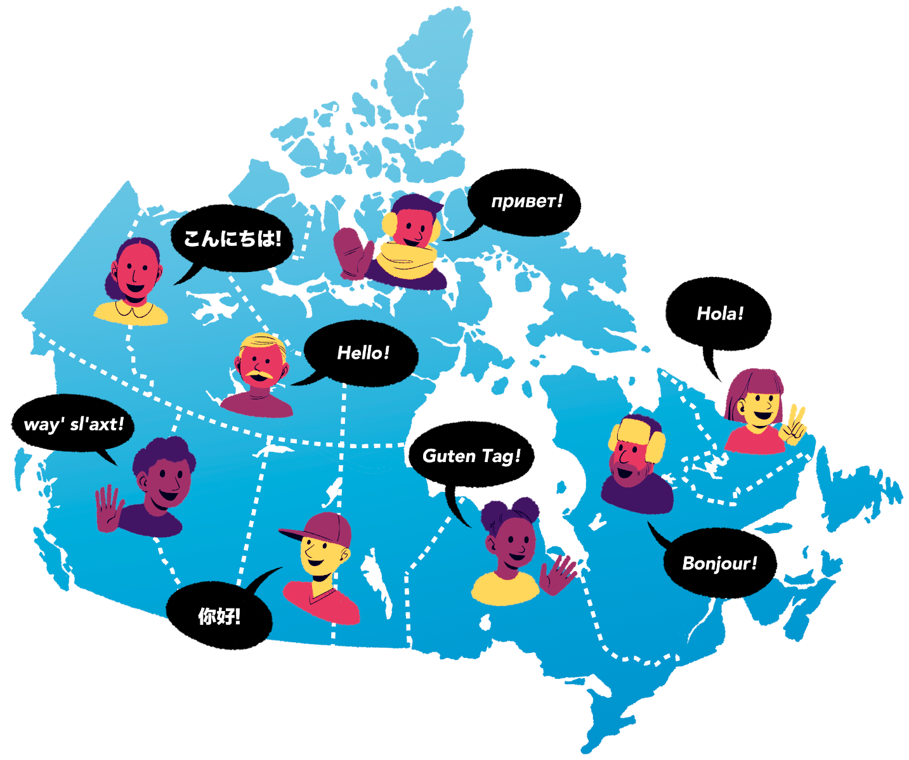

#


- Statistics is known as the science of working with **data**


- Every good data analysis begins with a **question** that you aim to answer


- As it turns out, there are a number of different **types** of questions regarding data.


- Carefully **formulating a question**, and  then identifying **which type of question it is**, can help us learn new things about the world.

<br>

|Question type|    Description         |     Example        |
|-------------|------------------------|--------------------|
| **Descriptive** | A question that asks to summarize data without interpretation (i.e., report a fact). | How many people live in each province and territory in Canada? |
| **Exploratory** | A question that asks if there are patterns, trends, or relationships within a data set. | Does the amount of languages that people can understand change across the regions of Canada? |
| **Predictive** | A question that asks about predicting something for individuals (people or things). The focus is on what things predict some outcome, but not what causes the outcome. | Based on where somebody lives, can we predict what languages they might understand? |
| **Inferential** | A question that asks how the patterns in a data set are related to the wider population. | How could the number of people that can speak French in Antigonish be used to estimate the amount of French speakers in Nova Scotia? |
| **Causal** | A question that asks about whether changing one factor will lead to a change in another factor in the wider population. | Would increasing government spending on education lead to a higher proportion of Nova Scotians that can understand more than one language? |


##  Tools to Analyze Data

- **Summarization**: computing and reporting aggregated values pertaining to a data set.


- **Visualization**: plotting data graphically.


- **Modelling**: developing a method for understanding relationships and making predictions.


- **Estimation**: using sample data to answer inferential questions.

---

# Example #1

```{r echo=FALSE, out.width="80%", fig.align = "center"}

```

Let's look at a dataset  which contains population language data collected during the 2016 Canadian census.

```{webr-r}
#| context: setup
#| autorun: true

library(dplyr)

category <- c(
  "Other","Other","Other","Other","Indigenous","Indigenous","Other","Other","Other","Other",
  "Other","Indigenous","Indigenous","Other","Other","Other","Indigenous","Other","Indigenous","Other",
  "Other","Other","Other","Other","Indigenous","Other","Other","Other","Other","Indigenous",
  "Other","Indigenous","Other","Other","Other","Indigenous","Other","Other","Indigenous","Indigenous",
  "Other","Other","Other","Other","Other","Indigenous","Other","Indigenous","Other","Indigenous",
  "Other","Other","Other","Official","Other","Other","Other","Other","Official","Other",
  "Other","Other","Other","Other","Other","Other","Indigenous","Other","Other","Indigenous",
  "Indigenous","Indigenous","Other","Other","Indigenous","Other","Other","Indigenous","Other","Other",
  "Other","Other","Other","Other","Other","Indigenous","Other","Indigenous","Indigenous","Indigenous",
  "Indigenous","Other","Other","Other","Other","Other","Other","Other","Indigenous","Other",
  "Other","Other","Other","Other","Indigenous","Indigenous","Other","Other","Indigenous","Other",
  "Other","Other","Other","Other","Other","Other","Indigenous","Other","Other","Other",
  "Indigenous","Indigenous","Other","Other","Indigenous","Other","Indigenous","Indigenous","Indigenous","Other",
  "Other","Other","Indigenous","Indigenous","Indigenous","Indigenous","Other","Indigenous","Indigenous","Indigenous",
  "Indigenous","Indigenous","Other","Other","Other","Indigenous","Other","Other","Other","Other",
  "Indigenous","Other","Other","Other","Other","Other","Other","Other","Indigenous","Indigenous",
  "Other","Indigenous","Other","Other","Other","Other","Indigenous","Other","Other","Other",
  "Indigenous","Indigenous","Other","Other","Other","Other","Indigenous","Indigenous","Indigenous","Other",
  "Indigenous","Indigenous","Indigenous","Other","Indigenous","Other","Other","Indigenous","Other","Other",
  "Other","Other","Indigenous","Other","Other","Other","Indigenous","Other","Other","Other",
  "Other","Other","Other","Other","Other","Indigenous","Other","Other","Other","Indigenous",
  "Other","Other","Other","Other"
)

language <- c(
  "Afrikaans","Afro-Asiatic languages, n.i.e.","Akan (Twi)","Albanian",
  "Algonquian languages, n.i.e.","Algonquin","American Sign Language","Amharic","Arabic","Armenian",
  "Assyrian Neo-Aramaic","Athabaskan languages, n.i.e.","Atikamekw","Austro-Asiatic languages, n.i.e",
  "Austronesian languages, n.i.e.","Azerbaijani","Babine (Wetsuwet'en)","Bamanankan","Beaver","Belarusan",
  "Bengali","Berber languages, n.i.e.","Bikol","Bilen","Blackfoot","Bosnian","Bulgarian","Burmese","Cantonese","Carrier",
  "Catalan","Cayuga","Cebuano","Celtic languages, n.i.e.","Chaldean Neo-Aramaic","Chilcotin",
  "Chinese languages, n.i.e.","Chinese, n.o.s.","Comox","Cree, n.o.s.","Creole languages, n.i.e.","Creole, n.o.s.",
  "Croatian","Cushitic languages, n.i.e.","Czech","Dakota","Danish","Dene","Dinka","Dogrib (Tlicho)",
  "Dravidian languages, n.i.e.","Dutch","Edo","English","Estonian","Ewe","Fijian","Finnish","French","Frisian",
  "Fulah (Pular, Pulaar, Fulfulde)","Ga","Ganda","Georgian","German","Germanic languages, n.i.e.",
  "Gitxsan (Gitksan)","Greek","Gujarati","Gwich'in","Haida","Haisla","Haitian Creole","Hakka","Halkomelem",
  "Harari","Hebrew","Heiltsuk","Hiligaynon","Hindi","Hmong-Mien languages","Hungarian","Icelandic","Igbo","Ilocano",
  "Indigenous n.o.s","Indo-Iranian languages, n.i.e.","Inuinnaqtun (Inuvialuktun)","Inuit languages, n.i.e.","Inuktitut",
  "Iroquoian languages, n.i.e.","Italian","Italic (Romance) languages, n.i.e.","Japanese","Kabyle","Kannada",
  "Karenic languages","Kashmiri","Kaska (Nahani)","Khmer (Cambodian)","Kinyarwanda (Rwanda)","Konkani","Korean",
  "Kurdish","Kutenai","Kwakiutl (Kwak'wala)","Lao","Latvian","Lillooet","Lingala","Lithuanian","Macedonian","Malagasy",
  "Malay","Malayalam","Malecite","Maltese","Mandarin","Marathi","Mi'kmaq","Michif","Min Dong",
  "Min Nan (Chaochow, Teochow, Fukien, Taiwanese)","Mohawk","Mongolian","Montagnais (Innu)","Moose Cree","Naskapi",
  "Nepali","Niger-Congo languages, n.i.e.","Nilo-Saharan languages, n.i.e.","Nisga'a","North Slavey (Hare)",
  "Northern East Cree","Northern Tutchone","Norwegian","Nuu-chah-nulth (Nootka)","Oji-Cree","Ojibway","Okanagan",
  "Oneida","Oriya (Odia)","Oromo","Other languages, n.i.e.","Ottawa (Odawa)",
  "Pampangan (Kapampangan, Pampango)","Pangasinan","Pashto","Persian (Farsi)","Plains Cree","Polish","Portuguese",
  "Punjabi (Panjabi)","Quebec Sign Language","Romanian","Rundi (Kirundi)","Russian","Salish languages, n.i.e.",
  "Sarsi (Sarcee)","Scottish Gaelic","Sekani","Semitic languages, n.i.e.","Serbian","Serbo-Croatian","Shona",
  "Shuswap (Secwepemctsin)","Sign languages, n.i.e","Sindhi","Sinhala (Sinhalese)","Siouan languages, n.i.e.",
  "Slavey, n.o.s.","Slavic languages, n.i.e.","Slovak","Slovene (Slovenian)","Somali","South Slavey",
  "Southern East Cree","Southern Tutchone","Spanish","Squamish","Stoney","Straits","Swahili","Swampy Cree",
  "Swedish","Tagalog (Pilipino, Filipino)","Tahltan","Tai-Kadai languages, n.i.e","Tamil","Telugu","Thai",
  "Thompson (Ntlakapamux)","Tibetan","Tibeto-Burman languages, n.i.e.","Tigrigna","Tlingit","Tsimshian",
  "Turkic languages, n.i.e.","Turkish","Ukrainian","Uralic languages, n.i.e.","Urdu","Uyghur","Uzbek",
  "Vietnamese","Vlaams (Flemish)","Wakashan languages, n.i.e.","Waray-Waray","Welsh","Wolof","Woods Cree",
  "Wu (Shanghainese)","Yiddish","Yoruba"
)

mother_tongue <- c(
  10260,1150,13460,26895,45,1260,2685,22465,419890,33460,
  16070,50,6150,170,4195,3255,110,1535,190,810,
  73125,8985,1785,805,2815,12215,20020,3585,565270,1025,
  870,45,19890,525,5545,655,615,38580,85,64050,
  4985,64110,48200,365,22295,1210,12630,10700,2120,1650,
  490,99015,1670,19460850,5445,1760,745,15295,7166700,2100,
  2825,920,1295,1710,384040,525,880,106525,108780,255,
  80,90,3030,10910,480,1320,19530,100,6880,110645,
  795,61235,1285,4235,26345,590,5185,1020,310,35210,
  35,375635,720,43640,13150,3970,4705,565,180,20130,
  5250,3330,153425,11705,110,325,12670,5450,315,3805,
  7075,16770,1430,12275,28565,300,5565,592040,8295,6690,
  465,1230,31800,985,1575,10235,105,1205,18275,19135,
  3750,400,765,315,220,4615,280,12855,17885,275,
  60,1055,4960,3685,150,4045,1390,16905,214200,3065,
  181710,221535,501680,695,96660,5850,188255,260,80,1090,
  85,2150,57350,9550,3185,445,4125,11860,16335,55,
  280,2420,17580,9785,36755,945,45,70,458850,40,
  3025,80,13370,1440,6840,431385,95,85,140720,15660,
  9255,335,6160,1405,16645,95,200,1315,32815,102485,
  10,210815,1035,1720,156430,3895,10,1110,1075,3990,
  1840,12915,13555,9080
)

most_at_home <- c(
  4785,445,5985,13135,10,370,3020,12785,223535,21510,
  10510,10,5465,80,1160,1245,20,345,50,225,
  47350,2615,290,615,1110,6045,11985,2245,400220,250,
  350,10,7205,80,3445,255,280,23940,0,37950,
  2005,24570,16775,180,6235,255,855,7710,1130,1020,
  190,9565,410,22162865,975,405,195,2790,6943800,185,
  825,250,345,1040,120335,1630,315,44550,64150,50,
  10,20,1280,4085,50,735,8560,5,2210,55510,
  335,19480,270,1000,9125,235,2380,165,90,29230,
  5,115415,175,19785,5490,1630,3860,135,20,10885,
  1530,720,109705,6580,10,25,6175,1255,25,1045,
  2015,6830,430,3625,15440,55,1125,462890,3780,3565,
  80,345,13965,255,905,8585,10,1195,13375,4010,
  1520,75,340,110,30,350,30,7905,6175,80,
  15,475,3410,1110,75,1200,240,10590,143025,1345,
  74780,98710,349140,730,53325,2110,116595,25,10,190,
  15,1205,31750,3890,1035,50,6690,4975,7790,20,
  105,670,5610,2055,22895,370,15,5,263505,5,
  1950,25,5370,330,1050,213790,5,30,96955,8280,
  3365,20,4590,655,10205,0,30,455,18955,28250,
  5,128785,610,995,104245,355,0,310,95,1385,
  800,7650,7085,2615
)

most_at_work<- c(
  85,10,25,345,0,40,1145,200,5585,450,
  205,0,1100,0,35,25,10,0,0,0,
  525,15,0,15,85,155,200,75,58820,15,
  30,10,70,10,35,15,0,2935,0,7800,
  15,310,220,0,70,20,85,770,0,165,
  0,1165,0,15265335,55,10,0,105,3825215,40,
  0,0,25,25,10065,725,10,1020,885,10,
  0,0,25,70,20,0,825,10,25,1405,
  10,440,0,10,110,30,20,30,15,8795,
  0,1705,25,3255,15,10,135,0,10,475,
  25,10,12150,185,0,15,150,35,15,10,
  60,95,0,140,95,10,25,60090,30,915,
  10,30,565,30,10,2055,0,370,195,30,
  0,10,95,35,0,70,10,1080,765,20,
  0,0,45,80,0,10,0,50,4580,95,
  2495,7485,27865,130,745,0,4855,0,0,15,
  0,65,530,30,0,35,645,35,40,0,
  10,10,100,15,220,35,0,0,13030,10,
  240,15,80,10,125,3450,0,0,2085,40,
  525,0,50,15,130,10,10,10,690,1210,
  0,1495,20,15,8075,35,0,0,0,10,
  75,105,895,15
)

lang_known <- c(
  23415,2775,22150,31930,120,2480,21930,33670,629055,41295,
  19740,85,6645,190,5585,5455,210,3190,340,2265,
  91220,12510,2075,1085,5645,18265,22425,4995,699125,2100,
  2035,125,27040,3595,7115,1150,590,41685,185,86115,
  16635,133045,69835,480,28725,1760,15750,13060,2475,2375,
  790,120870,3220,29748265,6070,3000,1665,17590,10242945,2910,
  4725,2250,2495,2150,502735,8705,1305,150965,149045,360,
  465,175,6855,12445,1060,1715,75020,125,7925,433365,
  870,71285,1780,8855,34530,665,8870,1975,470,40620,
  115,574725,2680,83095,17120,8245,4895,905,365,27035,
  7860,6790,172750,15290,170,605,17235,6500,790,17010,
  8185,23075,2340,22470,37810,760,7625,814450,15565,9025,
  1210,1045,42840,2415,2095,11445,195,1465,21385,40760,
  4550,1055,1005,550,280,8120,560,15605,28580,820,
  185,1530,6245,9730,205,5425,1800,23180,252325,5905,
  214965,295955,668240,4665,115050,8590,269645,560,145,3980,
  185,3220,73780,11275,5430,1305,22280,20260,27825,140,
  675,2995,21470,11490,49660,1365,40,145,995260,285,
  3675,365,38685,2350,14140,612735,265,115,189860,23165,
  15395,450,7050,2380,21340,260,410,1875,50770,132115,
  25,322220,1390,2465,198895,4400,25,1395,1695,8240,
  2665,16530,20985,22415
)

can_lang <-data.frame(category = as.factor(category),
                      language = as.factor(language),
                      mother_tongue,
                      lang_known,
                      most_at_home,
                      most_at_work)

attach(can_lang)

  
```


```{r, include=F}

library(dplyr)
library(forcats)
library(canlang)

data(can_lang)
can_lang[1,2]<-"Indigenous n.o.s"
can_lang$category <- as.factor(can_lang$category)
can_lang$language <- as.factor(can_lang$language)
can_lang<-can_lang |> 
  mutate(category = fct_recode(category, "Official" = "Official languages"),
         category = fct_recode(category, "Indigenous" = "Aboriginal languages"),
        category = fct_recode(category, "Other" = "Non-Official & Non-Aboriginal languages") 
        ) |> 
  arrange(language)


```

The `can_lang` dataset contains 214 languages, each having six properties:

- `category`: Is the language an Official Canadian language, an Indigenous language, or other.

- `language`: The name of the language.

- `mother tongue`: Number of Canadian residents who reported the language as their mother tongue.

- `most_at_home`: Number of Canadian residents who reported the language as being spoken most often at home.

- `most_at_work`: Number of Canadian residents who reported the language as being used most often at work.

- `lang_known`: Number of Canadian residents who reported knowledge of the language.

The data can be found in the following table. You can click the column names to sort the data and use the filters at the bottom of the table to explore the data more closely.

```{r, echo=F}
library(DT)


datatable(can_lang, 
          options = list(pageLength = 10),
          filter = "bottom") 
```


### Coding

While we can answer some questions we might be interested in just by looking at the data in certain ways, in some instances we may want to write code to help us. In this demonstration, we will be using what is known as the `R` programming language to help.

To start, we can use the `summary` function to give us a snapshot of what our data looks like.

```{webr-r}
#| autorun: false
summary(can_lang)
```

If we wanted to look at a specific variable, we could use the `mean` function to calculate the average.

```{webr-r}
#| autorun: false
mean(___)
```

We might be interested in looking at summarizing data for different categories. We can do this by grouping the data before summarizing. For example, the following data is going to calculate the total number of people for each category that identified the language as their mother tongues. You can read the symbol `|>` in the code as "and then".

```{webr-r}
#| autorun: false
can_lang |> 
  group_by(category) |> 
  summarize(total = sum(mother_tongue))
```

---

# Example #2


Next, we are going to look at how we can make visuals to represent data. We will use a simple dataset for this which includes a small sample of Canadian cities with information on their population and area (in $km^2$).

```{webr-r}
#| autorun: false
#| context: setup

city <-c(
  "Belleville",
  "Lethbridge",
  "Thunder Bay",
  "Peterborough",
  "Saint John",
  "Brantford",
  "Moncton",
  "Guelph",
  "Trois-Rivières",
  "Saguenay",
  "Kingston",
  "Greater Sudbury",
  "Abbotsford - Mission",
  "Kelowna",
  "Barrie",
  "St. John's",
  "Sherbrooke",
  "Regina",
  "Saskatoon",
  "Windsor",
  "Victoria",
  "Oshawa",
  "Halifax",
  "St. Catharines - Niagara",
  "London",
  "Kitchener - Cambridge - Waterloo",
  "Hamilton",
  "Winnipeg",
  "Québec",
  "Edmonton",
  "Ottawa - Gatineau",
  "Calgary",
  "Vancouver",
  "Montréal",
  "Toronto"
)
area <- c(
  1354.6512, 3046.6970, 2618.2632, 1636.9834, 3793.4216,
  1086.2711, 2625.1211, 604.0036, 1052.8021, 3078.7992,
  2142.3286, 4372.1229, 651.9951, 3144.9002, 967.6767,
  850.4604, 1506.3600, 4408.8642, 6218.5050, 1032.3818,
  704.4339, 908.0614, 5963.1371, 1425.3440, 2677.8609,
  1106.6507, 1404.6567, 5410.8291, 3475.3858, 9857.7791,
  7168.9644, 5241.7010, 3040.4153, 4638.2406, 6269.9313
)

population <-c(
  103472, 117394, 121621, 121721, 126202, 134203, 144810,
  151984, 156042, 160980, 161175, 164689, 180518, 194882,
  197059, 205955, 212105, 236481, 295095, 329144, 367770,
  379848, 403390, 406074, 494069, 523894, 747545, 778489,
  800296, 1321426, 1323783, 1392609, 2463431, 4098927, 5928040
) 

cities <- data.frame(city = as.factor(city), area, population)
attach(cities)
```

```{r, echo=F}
city <-c(
  "Belleville",
  "Lethbridge",
  "Thunder Bay",
  "Peterborough",
  "Saint John",
  "Brantford",
  "Moncton",
  "Guelph",
  "Trois-Rivières",
  "Saguenay",
  "Kingston",
  "Greater Sudbury",
  "Abbotsford - Mission",
  "Kelowna",
  "Barrie",
  "St. John's",
  "Sherbrooke",
  "Regina",
  "Saskatoon",
  "Windsor",
  "Victoria",
  "Oshawa",
  "Halifax",
  "St. Catharines - Niagara",
  "London",
  "Kitchener - Cambridge - Waterloo",
  "Hamilton",
  "Winnipeg",
  "Québec",
  "Edmonton",
  "Ottawa - Gatineau",
  "Calgary",
  "Vancouver",
  "Montréal",
  "Toronto"
)
area <- c(
  1354.6512, 3046.6970, 2618.2632, 1636.9834, 3793.4216,
  1086.2711, 2625.1211, 604.0036, 1052.8021, 3078.7992,
  2142.3286, 4372.1229, 651.9951, 3144.9002, 967.6767,
  850.4604, 1506.3600, 4408.8642, 6218.5050, 1032.3818,
  704.4339, 908.0614, 5963.1371, 1425.3440, 2677.8609,
  1106.6507, 1404.6567, 5410.8291, 3475.3858, 9857.7791,
  7168.9644, 5241.7010, 3040.4153, 4638.2406, 6269.9313
)

population <-c(
  103472, 117394, 121621, 121721, 126202, 134203, 144810,
  151984, 156042, 160980, 161175, 164689, 180518, 194882,
  197059, 205955, 212105, 236481, 295095, 329144, 367770,
  379848, 403390, 406074, 494069, 523894, 747545, 778489,
  800296, 1321426, 1323783, 1392609, 2463431, 4098927, 5928040
) 

cities <- data.frame(city, area, population)


datatable(cities, 
          options = list(pageLength = 10),
          filter = "bottom") 
```


There is a generic `plot` function in R which is useful for creating quick visualizations of a data set. If you pass one numeric variable into this function, a quick plot will be made by creating a point for each observation in the order they occur in the data frame (index). Passing two numeric variables into this function will create a scatterplot, with the first variable corresponding to the x-axis and the second corresponding to the y-axis.

```{webr-r}
#| autorun: false
plot()
```


There are some arguments we can add to the `plot` function to make our visualizations more informative:

- main = "Title of the Graph"
- xlab = "x-axis label"
- ylab = "y-axis label"
- xlim = c(0,100) (changing the values on the x-axis)
- ylim = c(0,100) (changing the values on the y-axis)
- col = "colour" (full list of colours can be found [**here**](https://r-charts.com/colors/))
- pch = number (list of potential shapes for points can be found [**here**](https://r-charts.com/base-r/pch-symbols/))

We can even add text to our plots by incorporating the [**text function**](https://www.rdocumentation.org/packages/graphics/versions/3.6.2/topics/text).


### Barplots 

To draw a basic bar graph, we can simply use the `barplot` function and specify which variable it is that we want to represent the height of the bars. For example, we can use the following code to quickly plot the area for each of the cities:

```{webr-r}
#| autorun: false

barplot()

```

There are some arguments we can add to the `barplot` function to make our bar graph more informative.


- horiz = T (draw the bars horizontally) 
- name = variable to label the bars
- las = 2 (rotates the labels)
- cex.names = 0.5 (change the labels font size)


 


